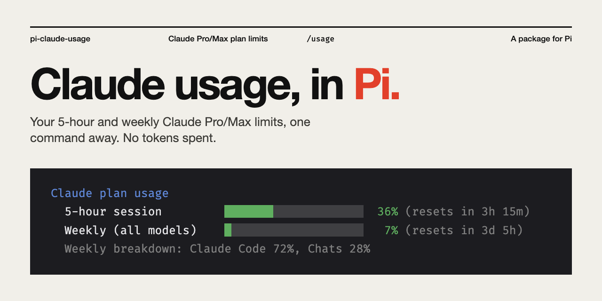

# pi-claude-usage

[](LICENSE)


Claude Code's `/usage` for the [Pi](https://pi.dev) coding agent: see how much of your Claude Pro/Max plan you've used, and when each limit resets.



```
Claude plan usage
  5-hour session         ███████░░░░░░░░░░░░░  36% (resets in 3h 15m)
  Weekly (all models)    █░░░░░░░░░░░░░░░░░░░   7% (resets in 3d 5h)
  Weekly breakdown: Claude Code 72%, Chats 28%
```

In Pi, the bars and percentages are colored green, then orange at 50%, then red at 80%.

The package contains:

- **`/usage` command**: prints your limits instantly without calling the model, so it costs no tokens. `/usage --json` shows the raw response.
- **`claude-usage` skill**: lets Pi answer questions like "how much Claude usage do I have left?"

## Requirements

- [Pi](https://pi.dev), signed in with a **Claude Pro or Max subscription** (OAuth). Pi's built-in Anthropic provider uses API keys; for subscription login, use an OAuth provider package such as [`@gotgenes/pi-anthropic-auth`](https://www.npmjs.com/package/@gotgenes/pi-anthropic-auth). API-key accounts don't have plan limits, so there is nothing to show.
- `bash`, `curl` and [`jq`](https://jqlang.org/) (`brew install jq` / `apt install jq`)

## Install

```sh
pi install git:github.com/fireseasonnow/pi-claude-usage
```

Then run `/reload` in any open Pi session, or start a new one, and type `/usage`.

To try it without installing:

```sh
pi -e git:github.com/fireseasonnow/pi-claude-usage
```

## How it works

The script gets your OAuth token from `pi auth print-bearer-token --provider anthropic` and queries `https://api.anthropic.com/api/oauth/usage`, the endpoint behind Claude Code's `/usage`. The token is only sent to Anthropic and is never printed.

The endpoint is rate limited, so responses are cached for 60 seconds. If a request fails, the last cached result is shown with a note saying how old it is.

The script also works on its own:

```sh
bash skills/claude-usage/scripts/usage.sh            # plain text
bash skills/claude-usage/scripts/usage.sh --color    # with colors
bash skills/claude-usage/scripts/usage.sh --json     # raw response
```

## Caveat

The usage endpoint is undocumented and may change without notice. If `/usage` breaks, check `/usage --json` and open an issue.

## License

MIT
